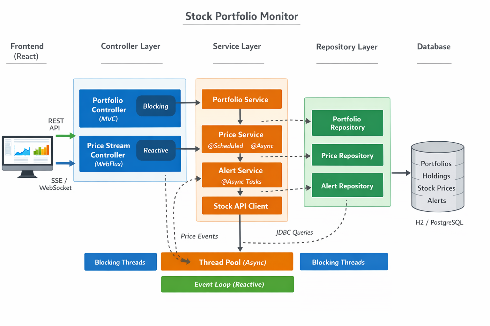

# stock-monitor

A Spring Boot application for monitoring stock portfolios, fetching market prices on a schedule, persisting price history, and streaming updates to clients.

* * *

## Quick Start

### Prerequisites

- Java 25 installed (`java --version`)
- Maven 3.9+ installed (`mvn --version`)
- Optional: PostgreSQL (for the `prod` profile)

### Install

From the project root:

```bash
mvn clean install
```

### Run (development)

```bash
mvn spring-boot:run -Dspring-boot.run.profiles=dev
```

### Run (production profile)

```bash
mvn spring-boot:run -Dspring-boot.run.profiles=prod
```

* * *

## Planned Features

- [x] Portfolio management endpoints (`/api/portfolios`)
- [ ] Real-time streaming endpoint (`/api/stream/prices`) using SSE
- [ ] Scheduled and asynchronous stock price fetching
- [x] Database bootstrap via `schema.sql` and `data.sql`
- [x] Profile-based configuration for local and production environments
- [ ] Alert persistence and full threshold evaluation workflow.
- [ ] Authentication and user-specific portfolio ownership.
- [ ] Improved event flow between scheduled price ingestion and streaming endpoints.
- [ ] Test coverage for controller, service, and repository layers.

* * *

## Architecture and Decisions

- `PortfolioController` is MVC/blocking and handles CRUD-style portfolio routes.
- `PriceStreamController` is reactive and exposes a text/event-stream endpoint.
- `PriceService` handles scheduled jobs and async fetch execution.
- `StockApiClient` isolates external stock API integration.
- `PriceRepository` uses JDBC for price persistence/read operations.
- `PortfolioRepository` uses Spring Data JPA for portfolio persistence.
- H2 is used for local development and PostgreSQL is used for production.

Design goal: keep the codebase small and understandable while supporting both request/response APIs and live streaming.

* * *

## Architecture Diagram



The diagram reflects the layered flow across frontend, controllers, services, repositories, and database, including async worker threads and reactive streaming concerns.

* * *

## API Endpoints

- `GET /api/portfolios` - list all portfolios
- `GET /api/portfolios/{id}` - fetch a portfolio by id
- `POST /api/portfolios` - create a portfolio
- `GET /api/stream/prices` - subscribe to live price updates (SSE)

* * *

## Tech Stack

- Java 25
- Spring Boot 4.0.2
- Spring Web MVC (`spring-boot-starter-webmvc`)
- Spring WebFlux (`spring-boot-starter-webflux`)
- Spring JDBC (`spring-boot-starter-jdbc`) with `JdbcTemplate`
- Reactor (`Flux`, `Sinks.Many`)
- H2 (dev/default runtime), PostgreSQL (prod runtime)
- Lombok
- Maven

* * *

## Project Structure

```text
stock-monitor/
|-- pom.xml
|-- src/
|   |-- main/
|   |   |-- java/com/example/stockmonitor/
|   |   |   |-- StockMonitorApplication.java
|   |   |   |-- config/
|   |   |   |-- controller/
|   |   |   |-- event/
|   |   |   |-- model/
|   |   |   |-- repository/
|   |   |   `-- service/
|   |   `-- resources/
|   |       |-- application.yml
|   |       |-- application-dev.yml
|   |       |-- application-prod.yml
|   |       |-- db/schema.sql
|   |       |-- db/data.sql
|   |       |-- static/
|   |       `-- templates/
|   `-- test/
|-- docs/
|   `-- architecture-diagram.png
`-- README.md
```

* * *

## Troubleshooting

- If startup fails in `prod`, verify PostgreSQL is running and credentials in `src/main/resources/application-prod.yml` are valid.
- If schema/data is not loaded, confirm SQL init settings in `src/main/resources/application.yml`.
- If SSE output is empty, verify the scheduled fetch path is active and publishing updates.

* * *

## Contributing

Contributions are welcome.

1. Create a feature branch.
2. Implement changes with tests where appropriate.
3. Open a pull request with a summary of the problem and solution.

* * *

## License

See `LICENSE` in the project root for license terms.
